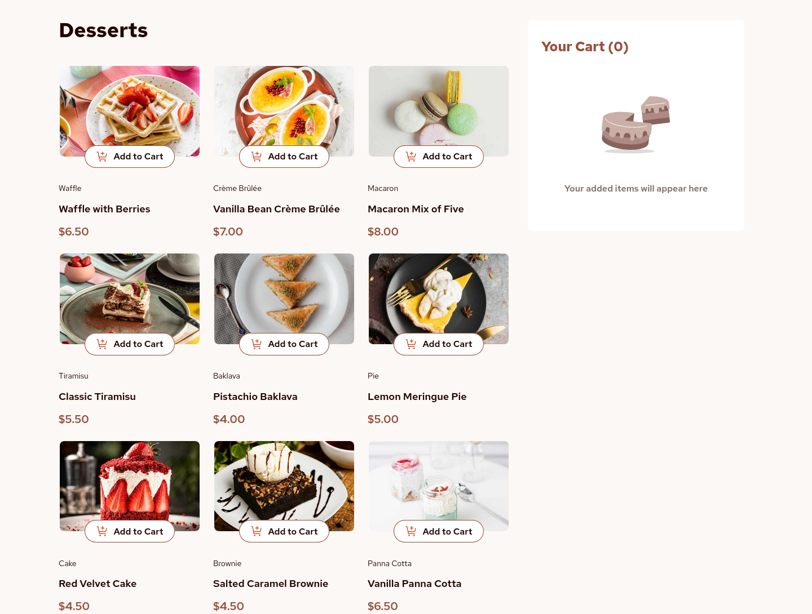

# Frontend Mentor - Product list with cart solution

This is a solution to the [Product list with cart challenge on Frontend Mentor](https://www.frontendmentor.io/challenges/product-list-with-cart-5MmqLVAp_d). Frontend Mentor challenges help you improve your coding skills by building realistic projects.

## Table of contents

- [Overview](#overview)
  - [The challenge](#the-challenge)
  - [Screenshot](#screenshot)
  - [Links](#links)
- [My process](#my-process)
  - [Built with](#built-with)
  - [What I learned](#what-i-learned)
  - [Continued development](#continued-development)
  - [Useful resources](#useful-resources)
- [Author](#author)

## Overview

### The challenge

Users should be able to:

- Add items to the cart and remove them
- Increase/decrease the number of items in the cart
- See an order confirmation modal when they click "Confirm Order"
- Reset their selections when they click "Start New Order"
- View the optimal layout for the interface depending on their device's screen size
- See hover and focus states for all interactive elements on the page
- Use the entire page only with the keyboard by pressing `tab`, `shift + tab` and `enter` keys

### Screenshot

### Links

- Solution URL: [https://www.frontendmentor.io/solutions/product-list-with-cart---vue-3-composition-api-and-typescript-G6U50Ht0e\_](https://www.frontendmentor.io/solutions/product-list-with-cart---vue-3-composition-api-and-typescript-G6U50Ht0e_)
- Live Site URL: [https://florianstancioiu.github.io/product-list-with-cart/](https://florianstancioiu.github.io/product-list-with-cart/)

## My process

### Built with

- Semantic HTML5 markup
- CSS custom properties
- Flexbox
- CSS Grid
- Mobile-first workflow
- [Vue](https://vuejs.org/) - JS library
- [Pinia](https://pinia.vuejs.org/) - Global state manager library for Vue
- [TypeScript](https://www.typescriptlang.org/) - JavaScript superset - it adds types to variables
- [TailwindCSS](https://tailwindcss.com/) - For styling

### What I learned

- I learned (a lot) about the Composition API in Vue 3
- I learned how to create stores (global states) for components using Pinia
- ~~I learned how to use the `<picture>` element~~ (I know the idea behind picture but I couldn't use it with container queries - I know it's duable but I couldn't do it myself)
- I learned that using anchor and button tabs makes the website accessible to people using only keyboards

### Continued development

- In future projects I will reach out to implement global state using the main store library sooner because I thought out this application without it and the code turned into a mess... I still had to use Pinia because the thing that I needed to achieve was impossible without breaking best practices.
- I will dedicate a (small) future project for focus states - ~~I didn't implement them here either~~ (There are no focus states here, I'm using the default focus styles from the browser)

### Useful resources

- [PX to REM | CSS Unit Converter](https://cssunitconverter.vercel.app/px-to-rem) - This helped me convert pxs to rem values - highly useful website
- [Official Vue Tutorial](https://vuejs.org/tutorial/#step-1) - This helped me get started with the Vue 3 composition API
- [The picture Element](https://developer.mozilla.org/en-US/docs/Web/HTML/Reference/Elements/picture) - This helped me to understand how to use the `<picture />` element
- [Static vs Dynamic props](https://vuejs.org/guide/components/props.html#static-vs-dynamic-props) - This helped me remind how to use dynamic props in Vue
- [Fetching Data - Vue example](https://vuejs.org/examples/#fetching-data) - This showed me how to fetch data with Vue's Composition API
- [How to import and use image in a Vue single file component?](https://stackoverflow.com/a/45116994/12159189) - This helped me include images correctly in Vue SFC
- [Vite SVG loader](https://www.npmjs.com/package/vite-svg-loader) - This helped me include SVGs as components in Vue
- [Teleport](https://vuejs.org/guide/built-ins/teleport.html#teleport) - This helped me create the modal, more specifically, it helped me move the modal in the body element
- [A guide to designing accessible, WCAG-conformant focus indicators](https://www.sarasoueidan.com/blog/focus-indicators/) - This helped me create focus states
- [CSS container queries](https://developer.mozilla.org/en-US/docs/Web/CSS/CSS_containment/Container_queries) - MDN article about container queries
- [What are container queries?](https://tailwindcss.com/docs/responsive-design#what-are-container-queries) - How to use container queries in TailwindCSS
- [Deep Watchers](https://vuejs.org/guide/essentials/watchers.html#deep-watchers) - This helped me scroll to top when the modal is opened

## Author

- Frontend Mentor - [@florianstancioiu](https://www.frontendmentor.io/profile/florianstancioiu)
- Threads - [@florianstancioiu01](https://www.threads.com/@florianstancioiu01)
- LinkedIn - [florianstancioiu](https://www.linkedin.com/in/florian-stancioiu-765661349/)
- freeCodeCamp - [florianstancioiu](https://www.freecodecamp.org/florianstancioiu)
